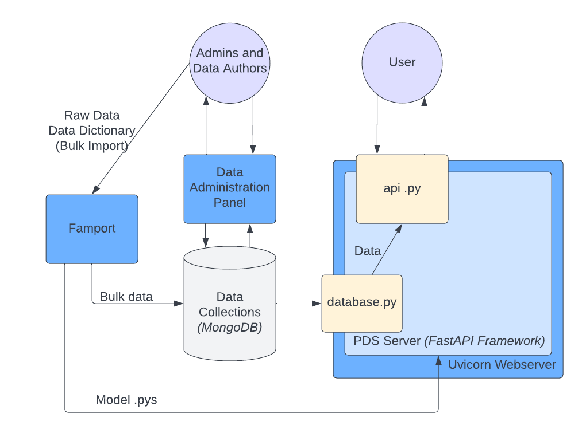

Architecture
==============================================

High-Level Overview
*****************

    
    Figure: The high-level overview of the architecture of the Plant Data Service.
   
The API
*****************

The PDS API application itself uses `FastAPI <'https://fastapi.tiangolo.com'>`_ FastAPI is a web framework used for creating REST API applications and, despite its newness, has gained popularity due to its asynchronous support and its ease of use. It was selected as the API framework over Django and Flask.
While Django has more built-in features than FastAPI, Django is not suited for NoSQL databases or linked data structures.
Flask is suited for basically however you want to organize your data, but generally takes longer to develop basic functionalities and it lacks a lot of things "out of the box".

Modules and tools included with FastAPI
The FastAPI has a toolbox of different modules and standards that you can use together for a robust application. Some of these important features include:

* `SwaggerUI <'https://swagger.io/tools/swagger-ui/'>`_: SwaggerUI is used to create beautiful and highly functional documentation of functions and defined object schemas automatically. 
* `Pydantic <'https://docs.pydantic.dev/'>`_: Pydantic is used for object relational mapping and data validation. It can be used to create schemas that define objects used in API responses and can be used in conjunction with SwaggerUI for extremely in-detail auto documentation.
* `OpenAPI <'https://www.openapis.org'>`_: OpenAPI is a set of standards used for easy interfacing with RESTful APIs. It used to be a part of Swagger before becoming its own project.

The webserver used for the API application
-----------------
The API runs on `Uvicorn <'https://uvicorn.org'>`_. Uvicorn is an ASGI (Asynchronous Server Gateway Interface) server for Python applications. Uvicorn allows for quick, asynchronous handling of requests. Generally speaking, Uvicorn is the recommended webserver for FastAPI applications.

Data Structuring and Database Management System Selection
*****************

Why we chose to use a NoSQL database
-----------------

It was determined earlier on in the development and design process that NoSQL was the way to go for storing data used by the PDS. Why?

#. NoSQL databases are highly flexible, and it's easy to link data together in a NoSQL database. For our purposes, NoSQL is a better option for representing plant data in a variety of contexts. This schemaless setup is also important for a system that uses data from many owners that all structure their data slightly differently.
#. They're easier to manage than a SQL database. While SQL databases work well for rigid data structures or large development teams, the level of management they require is not ideal for the PDS project.

Essentially, SQL Database Management Systems are based on a schema that *must* be adhered to. Our NoSQL DBMS, MongoDB, simply stores a collection of JSON documents within "collections" (analogous to separate databases within the same SQL server). These documents all have unique IDs and do not have to follow any specific defined schema. 

Why we chose MongoDB as our Database Management System (DBMS)
-----------------

A couple DBMSs were considered during the early phases of development. One promising DBMS was `OrientDB <https://orientdb.org>`_ , but Orient proved to be outdated for current versions of its Python tool and its related dependencies.
We settled with `MongoDB <https://mongodb.com>`_ since it is widely used (and more reliable than Orient). As a NoSQL DBMS, MongoDB stores collections of "documents" with non-rigid schemas. The flexibility of data storage allows data to be linked together.
