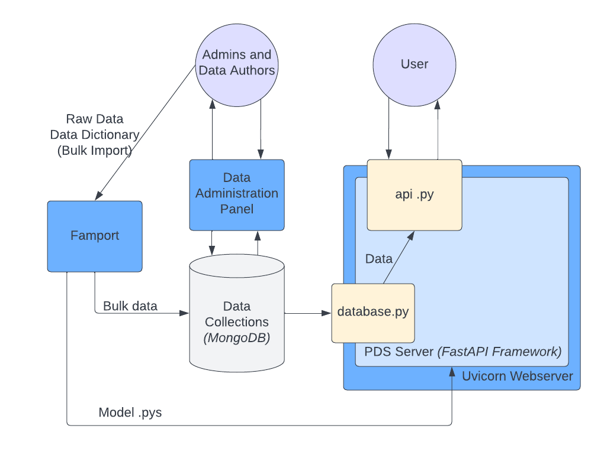

.. Plant Data Service documentation master file, created by
   sphinx-quickstart on Wed Jan 25 17:17:53 2023.
   You can adapt this file completely to your liking, but it should at least
   contain the root `toctree` directive.

About
==============================================
**Welcome to the Plant Data Service Documentation!**

.. image:: images/tree.png
   :width: 150
   :align: right

The Plant Data Service is an open-source plant data API. It was inspired by the growing need for information sharing within agriculture and was created to meet the needs of the National Cover Crop Councils.

.. note::
   This project is under active development.

You can demo the PDS `here <http://142.93.60.97/>`_ .

Deployment Instructions
==============================================

=================
Deployment on a Remote Server
=================

.. note::
    These instructions were written while using a 64-bit Ubuntu 22.10 Virtual Server and Python 3.10.7 for deployment.

#. **Ensure Python is installed.**

    * You can do this by just running ``python3``.

#. **Install the MongoDB server.**

    * Run ``wget -qO - https://www.mongodb.org/static/pgp/server-6.0.asc | sudo apt-key add -``. You should get 'OK' as a response.
    * Run ``echo "deb [ arch=amd64,arm64 ] https://repo.mongodb.org/apt/ubuntu focal/mongodb-org/6.0 multiverse" | sudo tee /etc/apt/sources.list.d/mongodb-org-6.0.list``. You'll need to replace the 'kinetic' part of this bit with the name of the Ubuntu release you are using. You can find the name using ``lsb_release -dc``. For example, Ubuntu 18.04 is named 'bionic'.
    * Get the packages. Run ``apt-get update`` to update your packages list and then ``sudo apt-get install -y mongodb-org``
    * Start MongoDB using ``sudo systemctl start mongod``.
    * It's time to set up a secure login for Mongo. Access the Mongo shell by running ``mongosh``. Use the admin database by running ``use admin`` and then run the following command, replacing the placeholders. **Your password cannot contain : / ? # [ ] @** ::
        db.createUser(
        {
        user: "yourusername", 
        pwd: "password", 
        roles:["root"]
        })
     
If the admin user has been successfully added, the shell will respond with an ok:1.

#. **Clone the GitHub repository.**

    * Run ``git clone https://github.com/ag-informatics/plant-data-service``. Use credentials as needed. GitHub passwords have switched to Personal Access Tokens.

#. **Extract the Plant Data Service files to wherever you want to run them from.**

    * Just do ``mv plant-data-service/plant-data-service directory/I/Want/To/Run/From`` replacing the last bit with whatever directory you want to house the PDS.

#. **Install dependencies.**

    * Run ``pip install -r requirements.txt`` referring to the requirements.txt included in this repository. The text file should be in the ``plant-data-service`` directory housing the repo. If you do not have Pip installed, you can install it with ``apt install python3-pip``.

#. **Update your Famport config and import the data.**

    * Navigate to where your Famport files are from step 4. In this case, it would be in directory/I/Want/To/Run/From/Famport and the configuration file is config.yml. Replace the default login info for Mongo using the credentials you set up in step 2e within the config.yml Then, import all data using ``python3 main.py --importAllDataAndDictionaries`` in the Famport directory. There will be a lot of printed statements, but if the database connection is successful and things are running smoothly there should be no crashes.

#. **Update your PDS config.**

    * Navigate to where the PDS itself (folder: api_application) is located. Edit the config.yml in the server directory in there to reflect the same database settings as you updated in the previous step.

#. **You're done!**

    * You can confirm that the PDS is working properly by navigating to your IP or domain in your browser. To keep the Python process running, consider using [Screen](https://help.ubuntu.com/community/Screen).

Architecture Overview
==============================================

=================
High-Level Architecture
=================

    
    Figure: The high-level overview of the architecture of the Plant Data Service.

Data Structuring and Database Management System Selection
*****************

Why we chose to use a NoSQL database
-----------------

It was determined earlier on in the development and design process that NoSQL was the way to go for storing data used by the PDS. Why?

#. NoSQL databases are highly flexible, and it's easy to link data together in a NoSQL database. For our purposes, NoSQL is a better option for representing plant data in a variety of contexts. This schemaless setup is also important for a system that uses data from many owners that all structure their data slightly differently.
#. They're easier to manage than a SQL database. While SQL databases work well for rigid data structures or large development teams, the level of management they require is not ideal for the PDS project.

Essentially, SQL Database Management Systems are based on a schema that *must* be adhered to. Our NoSQL DBMS, MongoDB, simply stores a collection of JSON documents within "collections" (analogous to separate databases within the same SQL server). These documents all have unique IDs and do not have to follow any specific defined schema. 

Why we chose MongoDB as our Database Management System (DBMS)
-----------------

A couple DBMSs were considered during the early phases of development. One promising DBMS was `OrientDB <https://orientdb.org>`_ , but Orient proved to be outdated for current versions of its Python tool and its related dependencies.
We settled with `MongoDB <https://mongodb.com>`_ since it is widely used (and more reliable than Orient). As a NoSQL DBMS, MongoDB stores collections of "documents" with non-rigid schemas. The flexibility of data storage allows data to be linked together.

 